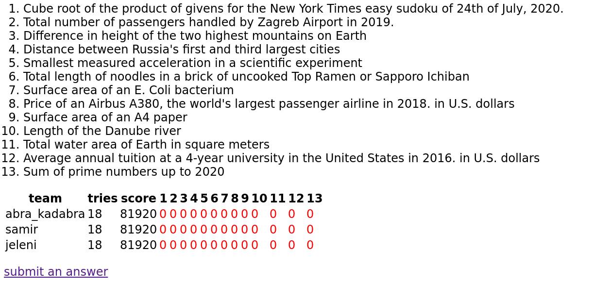
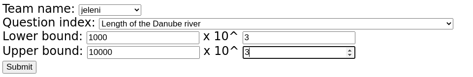

# Estimathon web style application for couch tournaments

A simple [flask](https://flask.palletsprojects.com/en/1.1.x/) application for playing [estimathons](https://estimathon.com/) with friends in a home setting.
The idea behind creating an application instead of using a simple spreadsheet is for everyone present to be able to play without the need of a game master.
It is inteded to run the app on a pc on a local network so that everyone can submit answers using their phones.
This might be a bad idea for those who don't trust each other because phones are otherwise disallowed.
Questions are chosen through the `questions.yaml` file (13 random).
A good idea is to get everyone to choose 2 questions.
Already existing questions assume [SI units](https://en.wikipedia.org/wiki/International_System_of_Units), unless stated in questions themselves.
The application doesn't handle malicious input (yet).

### Start page


### Results page



### Submit page



### Setup

```
git clone <this repo>
pip3 install flask
python estimathon.py
```

### Question Ideas

- math problems
- deathtoll/casualties in wars
- total distance of motorways/railways/roads in a country
- number of islands in a country/continent
- amount of material used in a construction
- total length/width/amount of rivers in a country
- surface area of water bodies
- duration of a movie series in weeks cubed
- tons of product produced/imported/exported
- medical procedures in a year on a continent
- total attendance of events in a year
- total budget of movies/series/events/projects


## TODO

- test app with phones on the local network
- handle malicious input
- keep a copy of the current state in a file
= load an already started game
- handle different units (unlikely)
- handle expressions in submitting an answer (unlikely)
